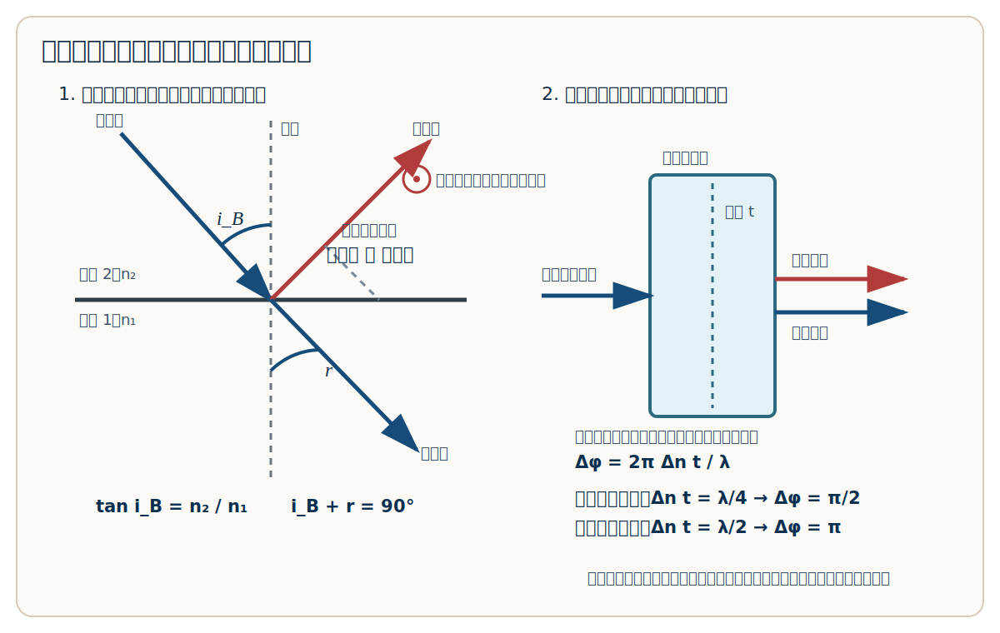

# 光的偏振从零讲解

适用目标：看懂偏振片、马吕斯定律、布儒斯特角、波片相位延迟这些公式到底从哪里来，以及考试时怎么用。

---

## 0. 一句话总览

光是横波。  
光的偏振，说的是光波的电场 `E` 在哪个方向振动。

最重要的分工：

| 模块 | 管什么 | 常用公式 |
|---|---|---|
| 偏振片 | 控制透过光强 | `I = I_in cos^2 θ` |
| 自然光过偏振片 | 自然光变成线偏振光 | `I = I0 / 2` |
| 布儒斯特角 | 反射光完全偏振 | `tan i_B = n2 / n1` |
| 波片 | 制造相位差 | `Δφ = 2πΔn t / λ` |
| 四分之一波片 | 制造 `π/2` 相位差 | `Δn t = λ / 4` |
| 二分之一波片 | 制造 `π` 相位差 | `Δn t = λ / 2` |

记忆句：

> 偏振片管强度，布儒斯特管反射偏振，波片管相位差。

---

## 1. 光为什么会有“偏振”

机械波里有纵波和横波。  
光是电磁波，而且是横波。

如果光沿着 `z` 方向传播，那么它的电场 `E` 不沿 `z` 方向振动，而是在垂直于传播方向的平面里振动，比如沿 `x` 或 `y` 方向振动。

所以：

```text
传播方向：光往哪里走
偏振方向：电场 E 往哪个方向振动
```

线偏振光：电场始终沿一个固定方向振动。  
自然光：电场方向乱七八糟，各种方向都有，平均起来没有一个固定偏振方向。

---

## 2. 偏振片：为什么自然光过一片后强度变一半

偏振片只允许沿它“透振方向”的电场分量通过。

假设入射光的电场振幅是 `E_in`，它和偏振片透振方向夹角为 `θ`。

能通过的电场分量是：

```text
E_out = E_in cos θ
```

光强与电场振幅平方成正比：

```text
I ∝ E^2
```

所以：

```text
I = I_in cos^2 θ
```

这就是马吕斯定律。

自然光的电场方向是随机的。对所有方向平均：

```text
平均 cos^2 θ = 1/2
```

因此自然光过第一片偏振片：

```text
I = I0 / 2
```

考试记法：

```text
自然光先砍半
线偏振再乘 cos^2 θ
```

---

## 3. 马吕斯定律怎么用

公式：

```text
I = I_in cos^2 θ
```

这里 `θ` 是：

```text
入射线偏振光的偏振方向 与 偏振片透振方向 的夹角
```

最常见题型：

```text
自然光 → 第一片偏振片 → 第二片偏振片
```

步骤：

```text
第一片后：I1 = I0 / 2
第二片后：I2 = I1 cos^2 θ
所以：I2 = (I0 / 2) cos^2 θ
```

如果两片偏振片互相垂直：

```text
θ = 90°
cos^2 90° = 0
```

所以完全不透光。

---

## 4. 布儒斯特角：反射光什么时候完全偏振

光打到介质界面上，一部分反射，一部分折射。

一般情况下，反射光只是部分偏振。  
但有一个特殊入射角，反射光会变成完全线偏振光，这个角叫布儒斯特角：

```text
i_B
```

公式：

```text
tan i_B = n2 / n1
```

其中：

```text
n1：入射介质折射率
n2：折射介质折射率
i_B：布儒斯特角
```

---

## 5. 布儒斯特公式怎么推出来

布儒斯特角的核心几何关系是：

```text
i_B + r = 90°
```

意思是：

```text
在布儒斯特角入射时，反射光和折射光互相垂直。
```

再用折射定律：

```text
n1 sin i_B = n2 sin r
```

因为：

```text
r = 90° - i_B
sin r = sin(90° - i_B) = cos i_B
```

代入折射定律：

```text
n1 sin i_B = n2 cos i_B
```

两边除以 `n1 cos i_B`：

```text
tan i_B = n2 / n1
```

所以布儒斯特角公式和反射偏振关系本质上是一套：

```text
tan i_B = n2 / n1
i_B + r = 90°
```

示意图：



对应图片文件：

```text
D:\虚拟C盘\大学物理\00_导航与计划\布儒斯特角与波片示意图.svg
```

图里要抓住两件事：

```text
i 是入射光和法线的夹角
r 是折射光和法线的夹角
```

在布儒斯特角时：

```text
反射光和折射光互相垂直
```

所以：

```text
i_B + r = 90°
```

这时反射光会变成完全线偏振光。注意，“完全偏振”说的是：

```text
反射光的电场振动方向只剩一个固定方向
```

不是说光线传播方向“偏离得更厉害”。

---

## 6. 波片：相位延迟是什么

有些晶体对两个互相垂直的偏振方向有不同折射率。

可以理解为：

```text
同一束光进入晶体后，被分解成两个互相垂直的偏振分量。
这两个分量在晶体里传播速度不同。
```

一个分量看到的折射率是 `n1`，另一个分量看到的折射率是 `n2`。

折射率差：

```text
Δn = |n1 - n2|
```

如果晶片厚度是 `t`，两束分量的光程差是：

```text
Δn t
```

相位差等于：

```text
Δφ = 2π × 光程差 / λ
```

所以：

```text
Δφ = 2πΔn t / λ
```

这就是相位延迟公式。

注意：波片不是“一个光直接反射，一个光进去后再反射”。

更准确的图像是：

```text
一束偏振光进入晶体
被分解成两个互相垂直的偏振分量
两个分量在晶体里传播速度不同
出来时相位就错开了
```

所以波片靠的是：

```text
双折射晶体内部传播速度不同
```

不是靠反射。

---

## 7. 四分之一波片和二分之一波片

波片本质上就是故意制造相位差。

### 四分之一波片

条件：

```text
Δn t = λ / 4
```

对应相位差：

```text
Δφ = 2π(λ/4)/λ = π/2
```

作用：

```text
线偏振光 ↔ 圆偏振光 / 椭圆偏振光
```

### 二分之一波片

条件：

```text
Δn t = λ / 2
```

对应相位差：

```text
Δφ = 2π(λ/2)/λ = π
```

作用：

```text
改变线偏振光的偏振方向
```

简单记法：

```text
λ/4 → 差 π/2 → 线偏振可变圆偏振
λ/2 → 差 π → 改变线偏振方向
```

### 和相机上的偏振镜有什么关系

相机上常见的“偏振镜”主要是偏振片，用来筛掉某些方向的偏振光。

它常用于：

```text
减少水面反光
减少玻璃反光
让天空颜色更深
提升画面反差
```

这不是因为它按颜色过滤，而是因为很多反射光本身带有明显偏振方向。

所以相机偏振镜的本质是：

```text
按偏振方向过滤反射光
```

它和滤光片不同：

```text
滤光片：按波长/颜色筛光
偏振片：按电场振动方向筛光
```

波片一般不是日常相机里最常说的“偏振镜”本体。波片更常用于光学实验中改变偏振态，比如把线偏振变成圆偏振，或者旋转偏振方向。

---

## 8. 考试时怎么选公式

看到“自然光通过偏振片”：

```text
I = I0 / 2
```

看到“两偏振片夹角 θ”：

```text
I = I_in cos^2 θ
```

看到“自然光通过两片偏振片，夹角 θ”：

```text
I = (I0 / 2) cos^2 θ
```

看到“反射光完全偏振”或“布儒斯特角”：

```text
tan i_B = n2 / n1
i_B + r = 90°
```

看到“晶片厚度 t、折射率差 Δn、相位差”：

```text
Δφ = 2πΔn t / λ
```

看到“四分之一波片”：

```text
Δn t = λ / 4
```

看到“二分之一波片”：

```text
Δn t = λ / 2
```

---

## 9. 最后一页速记

```text
自然光过偏振片：I = I0 / 2
马吕斯定律：I = I_in cos^2 θ
布儒斯特角：tan i_B = n2 / n1
反射偏振关系：i_B + r = 90°
相位延迟：Δφ = 2πΔn t / λ
四分之一波片：Δn t = λ / 4
二分之一波片：Δn t = λ / 2
```

一句话理解：

```text
偏振片筛方向，布儒斯特角让反射光变偏振，波片让两个偏振分量产生相位差。
```
