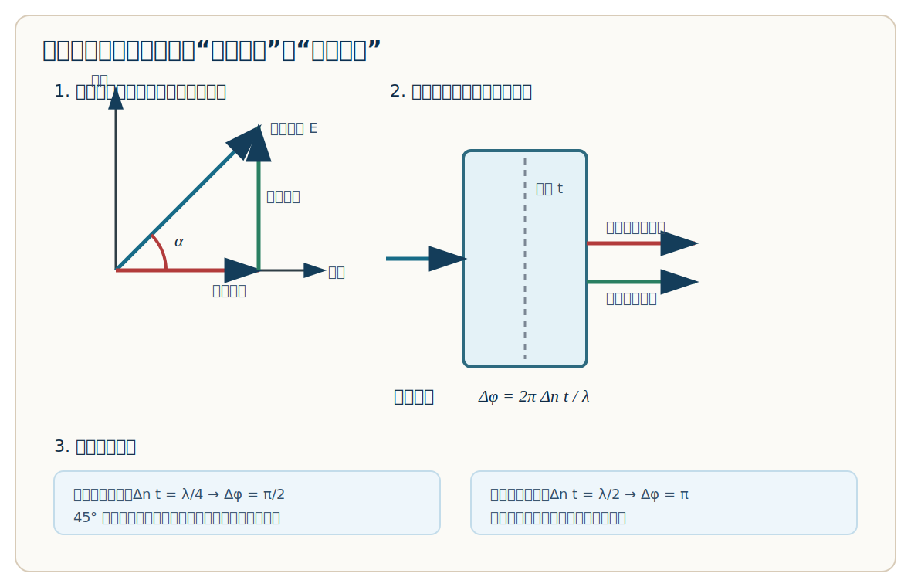

# 四分之一波片与二分之一波片

这份只讲一件事：波片到底在干什么，以及 `λ/4`、`λ/2` 为什么会改变偏振。

示意图：



图片文件：

```text
D:\虚拟C盘\大学物理\00_导航与计划\波片原理示意图.svg
```

---

## 1. 先把误会拆掉

波片不是滤光片。

```text
滤光片：按颜色/波长筛光
偏振片：按电场振动方向筛光
波片：不主要筛光，而是改变两个偏振分量之间的相位差
```

波片也不是“一个光直接反射、一个光进去后再反射”。

更准确的图像是：

```text
一束光进入晶体
它的电场被分成两个互相垂直的分量
一个沿快轴，一个沿慢轴
两个分量在晶体里速度不同
出射时就产生相位差
```

理想波片不主要改变光强，而是改变偏振态。

---

## 2. 快轴和慢轴

某些晶体叫双折射晶体。它对两个互相垂直的偏振方向有不同折射率。

折射率小的方向，光速大，叫快轴。

折射率大的方向，光速小，叫慢轴。

如果折射率差为：

```text
Δn
```

晶片厚度为：

```text
t
```

那么两个偏振分量走出的光程差为：

```text
Δn t
```

相位差为：

```text
Δφ = 2π Δn t / λ
```

这条公式就是所有波片题的根。

---

## 3. 为什么线偏振光进入波片后要分解

假设一束线偏振光的电场方向，和快轴夹角为 `α`。

它可以分解成两个分量：

```text
快轴分量：E_fast = E cos α
慢轴分量：E_slow = E sin α
```

这两个分量进入晶体后，传播速度不同。

所以出射时：

```text
快轴分量和慢轴分量之间多了一个相位差 Δφ
```

之后偏振态怎么变，全看这个 `Δφ`。

---

## 4. 四分之一波片

四分之一波片的条件：

```text
Δn t = λ / 4
```

代入相位延迟公式：

```text
Δφ = 2π(λ/4)/λ = π/2
```

所以四分之一波片的本质是：

```text
让快轴分量和慢轴分量相差 π/2
```

也就是相差四分之一个周期。

### 它会产生什么效果

如果入射线偏振光刚好和快轴成 `45°`，那么：

```text
E_fast = E_slow
```

两个分量大小相等，又差 `π/2` 相位。  
这时合成后的电场端点会绕圈转，形成圆偏振光。

所以：

```text
线偏振光 + 四分之一波片 + 45° 入射 → 圆偏振光
```

如果不是 `45°`，两个分量大小不等，就会变成椭圆偏振光。

```text
线偏振光 + 四分之一波片 + 非 45° 入射 → 椭圆偏振光
```

反过来，圆偏振光通过四分之一波片，也可以变成线偏振光。

### 考试记法

```text
λ/4 → π/2 → 线偏振和圆偏振之间转换
```

---

## 5. 二分之一波片

二分之一波片的条件：

```text
Δn t = λ / 2
```

代入相位延迟公式：

```text
Δφ = 2π(λ/2)/λ = π
```

所以二分之一波片的本质是：

```text
让快轴分量和慢轴分量相差 π
```

相差 `π` 就是一个分量相当于变号。

如果原来：

```text
E = E_fast + E_slow
```

通过二分之一波片后，相当于：

```text
E_slow → -E_slow
```

结果还是线偏振光，但方向被“翻过去”。

---

## 6. 二分之一波片为什么能旋转偏振方向

设入射线偏振光与快轴夹角为 `α`。

通过二分之一波片后，偏振方向会变成快轴另一侧的 `α`。

所以相对于原来的方向，总共转了：

```text
2α
```

这就是二分之一波片最常考的结论：

```text
二分之一波片会把线偏振方向旋转 2α
```

其中 `α` 是入射偏振方向和波片快轴之间的夹角。

### 考试记法

```text
λ/2 → π → 线偏振仍是线偏振，但方向旋转
```

---

## 7. 和相机偏振镜的关系

相机上常见的偏振镜主要是偏振片，不是波片。

它的作用是：

```text
筛掉某些方向的偏振光
```

所以可以：

```text
减少水面反光
减少玻璃反光
让天空颜色更深
提升画面对比度
```

原因是：水面、玻璃、天空散射光常常带有偏振特征。

但波片通常用于更实验化的场景：

```text
把线偏振变成圆偏振
把圆偏振变成线偏振
旋转线偏振方向
```

所以：

```text
相机偏振镜：主要是偏振片，负责筛方向
实验波片：负责改相位差，改变偏振态
```

---

## 8. 三句话背完

```text
波片靠双折射：两个偏振分量一个快一个慢。
四分之一波片制造 π/2 相位差，可让线偏振变圆/椭圆偏振。
二分之一波片制造 π 相位差，可旋转线偏振方向。
```

---

## 9. 考试看到题怎么用

看到“相位延迟、厚度、折射率差”：

```text
Δφ = 2π Δn t / λ
```

看到“四分之一波片”：

```text
Δn t = λ / 4
Δφ = π/2
```

看到“线偏振光以 45° 入射四分之一波片”：

```text
出射为圆偏振光
```

看到“二分之一波片”：

```text
Δn t = λ / 2
Δφ = π
```

看到“入射偏振方向和快轴夹角为 α，通过二分之一波片”：

```text
偏振方向旋转 2α
```
