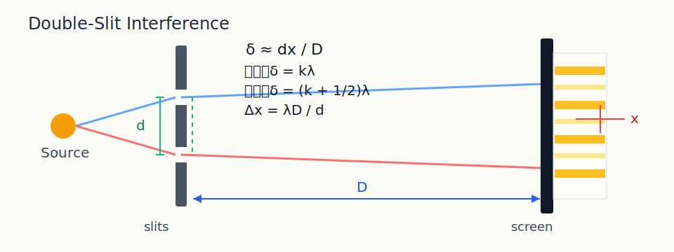
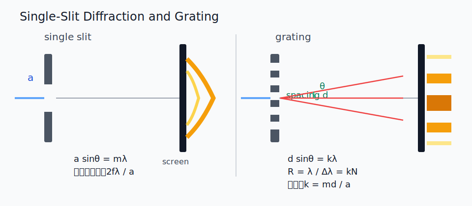
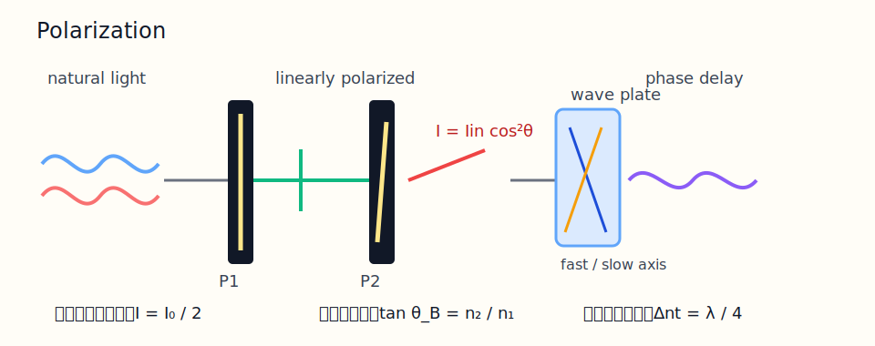
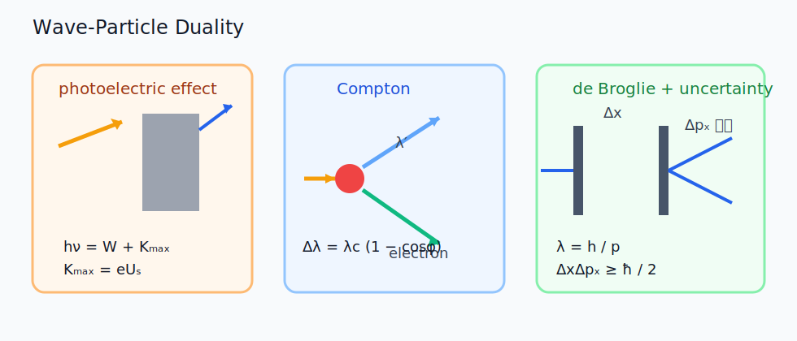
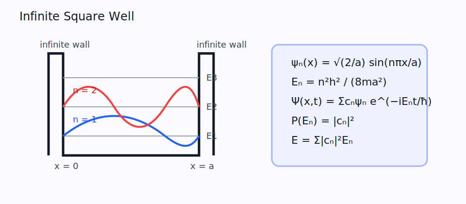
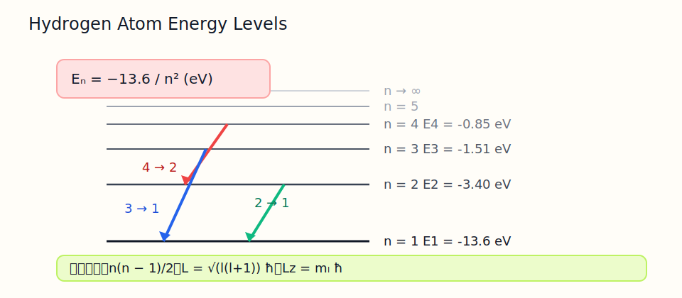

# 大学物理（2）期末一体化总复习

这份讲义按期末闭卷来写，核心目标只有一个：你在真正上考场时，看到题目就知道它属于哪一类、该写哪几个公式、最容易在哪一步丢分。

## 0. 考情定位

- 按你资料夹里的期末考试通知，范围主线是：`光学 + 量子物理`
- 结合教学进度和近年期末题，高频内容集中在：
  - 光学：第 22 章光的干涉、第 23 章光的衍射、第 24 章光的偏振
  - 量子：第 26 章波粒二象性、第 27 章薛定谔方程、第 28 章原子中的电子
- 第 29 章“固体中的电子”本讲义放在附录低优先度补充，不作为主复习线

## 1. 这份讲义怎么用最省时间

1. 先看每章开头的“你真正要抓住的物理图像”。
2. 再背“必背公式”和“高频题型”。
3. 最后只把例题和易错点看熟。
4. 临考前不要从头重看课件，直接回到本讲义和速记清单。

---

## 2. 第 22 章 光的干涉



### 2.1 你真正要抓住的物理图像

- 干涉的核心不是“两个缝”，而是“两个相干波源叠加”。
- 只要你能写出光程差 `delta`，题目基本就已经做完一半。
- 亮暗条纹判断只取决于相位差，也就是光程差。
- 双缝、薄膜、等厚干涉、迈克耳孙，本质上都是在求“哪两束光的光程差是多少”。

### 2.2 必背公式

```text
相位差：Delta phi = 2 pi delta / lambda

亮纹条件：delta = k lambda
暗纹条件：delta = (k + 1/2) lambda

双缝小角度近似：
delta ≈ d x / D

条纹间距：
Delta x = lambda D / d

在一条光路插入折射率 n、厚度 t 的介质片：
附加光程 = (n - 1) t

整套干涉图样平移量：
Delta x_shift = D (n - 1) t / d

迈克耳孙干涉仪镜面平移 Delta d：
2 Delta d = N lambda
```

### 2.3 高频题型 1：双缝干涉求第 k 级亮纹位置

标准判断流程：

1. 先写几何光程差 `delta ≈ d x / D`
2. 再代入亮纹或暗纹条件
3. 最后把 `x` 解出来

直接结论：

```text
第 k 级亮纹位置：x_k = k lambda D / d
第 k 级暗纹位置：x_k = (k + 1/2) lambda D / d
```

最常见变形：

- “第 5 条亮纹离中央多远”
- “相邻明纹间距是多少”
- “插入薄片后原来某条亮纹移到哪里”

### 2.4 高频题型 2：插片导致条纹整体平移

最安全的做法不是死记正负号，而是记住一句话：

- 干涉图样整体向**插片所在那一路**方向平移

平移量只看大小时：

```text
Delta x_shift = D (n - 1) t / d
```

如果题目要求“插片后第 5 级亮纹的新坐标”，就写：

```text
x'_5 = x_5 ± Delta x_shift
```

正负号由你选的坐标正方向决定，但物理上一定是“整套图样朝插片那边挪”。

### 2.5 高频题型 3：空间相干性，什么时候条纹消失

这类题最常见描述：

- 光源有宽度 `b`
- 光源离双缝距离 `L`
- 缝距 `d`
- 问条纹何时刚好消失，或最大允许光源宽度是多少

记住结论：

```text
b_max ≈ lambda L / d
```

解释：

- 光源太宽，不同位置发出的光对应不同相位，条纹被平均掉
- 本质还是“相干条件被破坏”

### 2.6 高频题型 4：迈克耳孙干涉仪

这部分非常爱考，而且分不难拿。

核心关系只有一个：

```text
镜面移动 Delta d
=> 光程差变化 2 Delta d
=> 条纹吞吐数 N = 2 Delta d / lambda
```

所以：

```text
Delta d = N lambda / 2
```

如果是转动反射镜形成等厚条纹，常见关系是：

```text
条纹间距 Delta x ≈ lambda / (2 alpha)
总条纹数 N ≈ 2 alpha L / lambda
```

其中 `alpha` 是两虚像镜面的夹角，`L` 是观测宽度。

### 2.7 高频题型 5：薄膜干涉与增透膜

这部分容易错在“半波损失”判断。

最稳的结论不是背一个式子，而是先数反射时是否有相位反转：

| 反射的两束光半波损失差 | 反射亮纹条件 | 反射暗纹条件 |
| --- | --- | --- |
| 相差 0 次或 2 次 | `2nt = k lambda` | `2nt = (k + 1/2) lambda` |
| 相差 1 次 | `2nt = (k + 1/2) lambda` | `2nt = k lambda` |

增透膜本质上是让**反射最弱**，所以你找的是反射暗纹条件。

### 2.8 典型例题：双缝 + 插片

题型原型：

- 双缝间距 `d`
- 屏距 `D`
- 光波长 `lambda`
- 求中央亮纹上方第 5 条亮纹位置
- 再在一条光路插入折射率 `n`、厚度 `t` 的薄片，求图样平移

解题骨架：

```text
原第 5 级亮纹：
x_5 = 5 lambda D / d

插片后整套图样平移：
Delta x_shift = D (n - 1) t / d

新位置：
x'_5 = x_5 ± Delta x_shift
```

### 2.9 这一章最容易错的点

- 把“相位差”和“光程差”混用，不先换成同一个量
- 忘了双缝小角近似 `delta ≈ d x / D`
- 插片题只改某一条纹位置，忘了本质是“整套图样一起挪”
- 迈克耳孙干涉仪漏掉系数 `2`
- 薄膜干涉没有先判断相位反转次数

---

## 3. 第 23 章 光的衍射



### 3.1 你真正要抓住的物理图像

- 干涉强调“少数几束光的相位叠加”
- 衍射强调“同一波面上许多次波源的叠加”
- 单缝衍射看的是一条缝内部各部分互相干涉
- 光栅衍射看的是“单缝包络 + 多缝干涉主极大”同时存在

### 3.2 必背公式

```text
单缝暗纹条件：
a sin(theta) = m lambda    (m = 1, 2, 3, ...)

焦平面中央明纹宽度：
Delta x_center = 2 f lambda / a

光栅主极大条件：
d sin(theta) = k lambda

光栅分辨本领：
R = lambda / Delta lambda = k N

缺级条件：
单缝暗纹与光栅主极大重合
a sin(theta) = m lambda
d sin(theta) = k lambda
=> k = m d / a

圆孔衍射分辨极限（Rayleigh）：
theta_min ≈ 1.22 lambda / D
```

### 3.3 高频题型 1：单缝中央明纹宽度

只要题目给出：

- 缝宽 `a`
- 波长 `lambda`
- 透镜焦距 `f`

就直接用：

```text
Delta x_center = 2 f lambda / a
```

如果没有透镜，而是远屏距离 `L`，小角度下也可以写成：

```text
Delta x_center ≈ 2 L lambda / a
```

### 3.4 高频题型 2：光栅主极大与级次判断

标准做法：

1. 先用 `d sin(theta) = k lambda` 解出 `d` 或 `k`
2. 再判断 `|sin(theta)| <= 1`，由此决定可见级次范围

极常见问法：

- “第几级主极大出现在某角度”
- “能观察到的最高级次是多少”
- “在某角区间内可见哪些级次”

### 3.5 高频题型 3：缺级

这是光栅题最爱拐弯的地方。

缺级不是主极大不存在，而是它恰好落在单缝暗纹位置上，被包络压没了。

联立：

```text
d sin(theta) = k lambda
a sin(theta) = m lambda
=> k = m d / a
```

常见题型：

- 已知第 3 级缺级，求可能的缝宽 `a`
- 已知 `d`，求最小可能缝宽

此时通常从最小正整数 `m = 1` 开始试，得到最小的 `a`。

### 3.6 高频题型 4：分辨本领

一看到“两条靠得很近的谱线能否分开”：

```text
R = lambda / Delta lambda = k N
```

所以：

- 级次越高，越容易分辨
- 总缝数越多，越容易分辨

这部分特别适合填空题。

### 3.7 高频题型 5：望远镜、显微镜分辨极限

常见叙述：

- 望远镜口径 `D`
- 光波长 `lambda`
- 问可分辨最小角距

直接用：

```text
theta_min ≈ 1.22 lambda / D
```

如果是问“距离多远时刚好能分辨两个车灯”，再用几何关系：

```text
theta ≈ l / L
```

其中 `l` 是两点间真实间距，`L` 是观察距离。

### 3.8 典型例题：光栅主极大 + 缺级

题型原型：

- 波长 `lambda`
- 在 `theta = 30°` 处获得 2 级主极大
- 3 级主极大缺级
- 求光栅常数、最小缝宽、在某角域内可见级次

解题骨架：

```text
先由 2 级主极大：
d sin 30° = 2 lambda
=> d = 4 lambda

再由 3 级缺级：
3 = m d / a

取最小 m = 1：
a = d / 3 = 4 lambda / 3

最后判断可见级次：
|k lambda / d| <= 1
=> |k| <= d / lambda = 4
```

如果题目把角域限制为 `(-45°, 45°)`，就还要额外满足 `|sin(theta)| < sin 45°`。

### 3.9 这一章最容易错的点

- 把单缝暗纹条件和光栅主极大条件写成同一个式子
- 缺级题只写 `d sin(theta) = k lambda`，忘了联立单缝暗纹
- 看到分辨本领题，不知道它是 `R = kN`
- 分辨极限题忘了 `1.22`
- 角域限制题只考虑 `sin(theta) <= 1`，不考虑题目给的区间

---

## 4. 第 24 章 光的偏振



### 4.1 你真正要抓住的物理图像

- 偏振研究的是光振动方向。
- 自然光振动方向杂乱；线偏振光有固定振动方向。
- 偏振片是在“筛选振动方向”。
- 波片不是减弱光强，而是在改变两个正交分量的相位差。

### 4.2 必背公式和条件

```text
自然光过理想偏振片：
I = I0 / 2

线偏振光过检偏器（马吕斯定律）：
I = Iin cos^2(theta)

三片偏振片串联：
I = I0 / 2 · cos^2(theta12) · cos^2(theta23)

布儒斯特角：
tan(iB) = n2 / n1

在布儒斯特角：
iB + r = 90°

波片相位延迟：
Delta phi = 2 pi Delta n t / lambda

四分之一波片：
Delta n t = lambda / 4

二分之一波片：
Delta n t = lambda / 2
```

### 4.3 如何判断输出是线偏振、圆偏振还是椭圆偏振

设两正交分量振幅分别为 `Ax`、`Ay`，相位差为 `Delta phi`。

快速判断：

- `Delta phi = 0` 或 `pi`：线偏振
- `Ax = Ay` 且 `Delta phi = ± pi/2`：圆偏振
- 其余一般是椭圆偏振

最常考的特殊情况：

- 线偏振光入射四分之一波片
- 如果入射方向与波片快慢轴成 `45°`，且分量幅值相等，输出是圆偏振光

### 4.4 高频题型 1：多片偏振片

这部分最好拿分。

例如：

- 自然光依次通过 `P1, P2, P3`
- `P1` 与 `P2` 夹角 `30°`
- `P2` 与 `P3` 夹角 `60°`

那就直接链式相乘：

```text
I1 = I0 / 2
I2 = I1 cos^2 30° = 3 I0 / 8
I3 = I2 cos^2 60° = 3 I0 / 32
```

### 4.5 高频题型 2：反射偏振与布儒斯特角

一看到：

- “反射光完全偏振”
- “自然光由空气射向折射率为 n 的介质”

就立刻想到：

```text
tan(iB) = n
r = 90° - iB
```

很多题其实最后问的不是入射角，而是折射角，此时直接写：

```text
r = 90° - iB
```

### 4.6 高频题型 3：波片

最核心的四个结论：

1. 线偏振光与四分之一波片光轴成 `45°` 入射，可变成圆偏振光
2. 圆偏振光通过四分之一波片，可变成线偏振光
3. 两块光轴相同的四分之一波片串联，等效于半波片
4. 线偏振光通过半波片后，振动方向相对光轴对称翻折，总旋转角是原夹角的 `2 倍`

### 4.7 典型例题：两块四分之一波片

题型原型：

- 一束偏振方向与光轴成 `45°` 的线偏振光
- 先后通过两块光轴方向相同的四分之一波片

做法：

1. 第一块四分之一波片：把线偏振光变为圆偏振光
2. 第二块四分之一波片：再把圆偏振光变为线偏振光
3. 两块合起来等效于半波片

结论：

- 最终输出仍是线偏振光
- 偏振方向相对于光轴翻转到另一侧

### 4.8 这一章最容易错的点

- 自然光经过第一片偏振片后忘了先除以 `2`
- 多片偏振片题只记得第一步，不会连乘
- 布儒斯特角题把反射角、折射角、入射角混掉
- 波片题只背结论，不会先拆成沿快慢轴的两个分量
- 判断偏振类型时忘了同时看“振幅关系”和“相位差”

---

## 5. 第 26 章 波粒二象性



### 5.1 你真正要抓住的物理图像

- 光既表现为波，也表现为粒子。
- 微观粒子既表现为粒子，也表现为波。
- 这一章的题几乎都能归到下面几类：
  - 黑体辐射
  - 光电效应
  - 康普顿散射
  - 德布罗意关系
  - 不确定关系
  - X 射线衍射

### 5.2 必背公式

```text
光子能量：
E = h nu = h c / lambda

黑体维恩位移定律：
lambda_m T = b

黑体斯特藩-玻尔兹曼定律：
M = sigma T^4

光电效应方程：
h nu = W + Kmax = W + e Us

红限频率：
nu0 = W / h

红限波长：
lambda0 = c / nu0 = h c / W

康普顿公式：
Delta lambda = lambda' - lambda = lambdaC (1 - cos phi)

反冲电子动能：
K = h c (1 / lambda - 1 / lambda')

德布罗意关系：
lambda = h / p

电子经电压 U 加速（非相对论）：
lambda = h / sqrt(2 m e U)

不确定关系：
Delta x Delta px >= hbar / 2

布拉格公式：
2 d sin(phi) = k lambda
```

### 5.3 高频题型 1：黑体辐射

看到：

- “最大单色辐出度对应波长改变”
- “总辐射本领变化多少倍”

就分两步：

```text
先用 lambda_m T = b 求温度比
再用 M = sigma T^4 求总辐射本领比
```

典型结论：

- 如果 `lambda_m` 由 `0.6 um` 变到 `0.4 um`
- 那么 `T2 / T1 = 0.6 / 0.4 = 1.5`
- 总辐射本领之比 `M2 / M1 = 1.5^4 = 5.0625`

### 5.4 高频题型 2：光电效应

一看到：

- 截止电压
- 逸出功
- 红限频率
- 光电子最大动能

就写：

```text
h nu = W + e Us
```

然后再根据题目去求：

- `W`
- `Us`
- `nu0 = W / h`
- `lambda0 = hc / W`

### 5.5 高频题型 3：康普顿散射

这部分填空题特别爱考“比值”。

如果给两个散射角 `phi1, phi2`，问波长改变量比值：

```text
Delta lambda1 / Delta lambda2
= (1 - cos phi1) / (1 - cos phi2)
```

因为电子康普顿波长 `lambdaC` 会约掉。

### 5.6 高频题型 4：德布罗意关系和不确定关系

常见题型：

- 由加速电压求电子波长
- 由单缝宽度估计横向动量不确定度

单缝估算题最稳定的近似就是：

```text
Delta px ~ hbar / (2 Delta x)
```

如果缝宽是 `a`，就把 `Delta x` 量级取成 `a`。

### 5.7 高频题型 5：X 射线衍射

容易错的地方只有一个：

- 题目里的角 `phi` 到底是掠射角还是与法线夹角

若题目说“掠射角”，就直接用：

```text
2 d sin(phi) = k lambda
```

### 5.8 典型例题：光电效应

题型原型：

- 已知入射光波长 `lambda`
- 已知截止电压 `Us`
- 求逸出功和红限频率

解题骨架：

```text
先算光子能量：
E = h c / lambda

再由：
E = W + e Us
=> W = h c / lambda - e Us

最后：
nu0 = W / h
```

### 5.9 这一章最容易错的点

- 黑体题把“波长反比于温度”写反
- 光电效应里把动能和逸出功加减写错
- 康普顿题忘了改变量只跟散射角有关
- 德布罗意题把光子和电子公式混用
- 不确定关系题把 `Delta x` 和“缝宽 / 半宽度 / 量级”关系处理混乱
- 布拉格公式不先看题目角度定义

---

## 6. 第 27 章 薛定谔方程与无限深方势阱



### 6.1 你真正要抓住的物理图像

- 这章最重要的不是微分方程本身，而是“态、测量、展开、时间演化”。
- 无限深方势阱是最常考模型，因为它既简单又能考出量子化、叠加和概率。
- 你要熟悉的是：
  - 本征函数
  - 本征能量
  - 初态展开
  - 时间演化
  - 概率与平均值

### 6.2 必背公式

```text
无限深方势阱（0 < x < a）本征函数：
psi_n(x) = sqrt(2/a) sin(n pi x / a)

本征能量：
E_n = n^2 h^2 / (8 m a^2)

一般态展开：
Psi(x,0) = sum c_n psi_n(x)

时间演化：
Psi(x,t) = sum c_n psi_n(x) exp(-i E_n t / hbar)

测到能量 E_n 的概率：
P(E_n) = |c_n|^2

能量平均值：
Eavg = sum |c_n|^2 E_n

位置区间概率：
P(x1 ~ x2) = integral from x1 to x2 of |Psi(x,t)|^2 dx

动量本征函数（整条 x 轴）：
Phi_p(x) = 1 / sqrt(2 pi hbar) · exp(i p x / hbar)
```

### 6.3 高频题型 1：已给初态，写出随时间演化的波函数

这类题只要初态已经拆成了本征态线性组合，就非常好做。

例如：

```text
Psi(x,0) = c1 psi1(x) + c2 psi2(x)
```

那就直接写：

```text
Psi(x,t) = c1 psi1(x) exp(-i E1 t / hbar)
        + c2 psi2(x) exp(-i E2 t / hbar)
```

### 6.4 高频题型 2：测量能量的概率与平均能量

只要初态展开出来了，概率和平均值基本不需要再积分。

```text
P(E_n) = |c_n|^2
Eavg = sum |c_n|^2 E_n
```

闭卷最爱考的不是复杂积分，而是你能不能看出哪几个系数就是概率幅。

### 6.5 高频题型 3：把给定波函数拆成势阱本征态

你要熟悉的技巧其实是高中三角恒等式：

```text
sin x cos x = 1/2 sin 2x
sin x (1 - cos x) = sin x - 1/2 sin 2x
```

因为很多看起来复杂的初态，最后其实就是 `psi1` 和 `psi2` 的线性组合。

### 6.6 高频题型 4：某区间内找到粒子的概率

步骤：

1. 先写出 `Psi(x,t)`
2. 再写出 `|Psi(x,t)|^2`
3. 最后在给定区间积分

如果是单一本征态：

- 概率分布不随时间变化

如果是两个本征态叠加：

- `|Psi|^2` 会出现随时间振荡的干涉项

### 6.7 高频题型 5：动量测量

近年期末题会把波函数写成平面波或几种指数函数的组合，让你求：

- 可能测得哪些动量
- 各概率是多少
- 平均动量是多少

最通用方法：

1. 把波函数写成若干 `exp(i p x / hbar)` 的线性组合
2. 系数模方就是对应动量概率
3. 平均动量是 `sum p_i P_i`

补充提醒：

- 在无限深势阱的单一本征态里，能量是确定的，但动量一般**不是**确定的
- 常见结果是 `+p_n` 与 `-p_n` 对称出现，平均动量为 `0`

### 6.8 典型例题：拆成本征态并求时间演化

设：

```text
Psi(x,0) = sqrt(8 / 5a) · (1 - cos(pi x / a)) · sin(pi x / a)
```

先化简：

```text
sin u (1 - cos u) = sin u - 1/2 sin 2u
```

所以：

```text
Psi(x,0)
= sqrt(8 / 5a) sin(pi x / a) - sqrt(8 / 5a) / 2 · sin(2 pi x / a)
= (2 / sqrt(5)) psi1(x) - (1 / sqrt(5)) psi2(x)
```

于是立刻得到：

```text
Psi(x,t)
= (2 / sqrt(5)) psi1(x) exp(-i E1 t / hbar)
 - (1 / sqrt(5)) psi2(x) exp(-i E2 t / hbar)
```

能量概率：

```text
P(E1) = 4 / 5
P(E2) = 1 / 5
```

平均能量：

```text
Eavg = (4/5) E1 + (1/5) E2
```

在 `0 ~ a/2` 区间内的概率可写成：

```text
P(0 ~ a/2, t) = 1/2 - [16 / (15 pi)] cos[(E2 - E1)t / hbar]
```

这道题非常典型，因为它同时覆盖了：

- 势阱本征态展开
- 时间演化
- 测量概率
- 区域概率

### 6.9 这一章最容易错的点

- 忘了势阱定义区间是 `0 < x < a`
- 本征函数前面的归一化系数写错
- 初态一展开就慌，不会用三角恒等式
- 把 `|c_n|^2` 和 `c_n` 混了
- 位置概率积分时忘了取模平方
- 动量题里把“动量可能值”和“平均动量”混在一起

---

## 7. 第 28 章 原子中的电子



### 7.1 你真正要抓住的物理图像

- 氢原子最重要的是离散能级。
- 光谱线来自能级跃迁。
- 量子数是描述电子量子态的标签。
- 这章最常考的题型其实很固定：
  - 氢原子能级和跃迁
  - 谱线条数
  - 可见光中最短波长
  - 量子数范围
  - 轨道角动量大小和分量

### 7.2 必背公式

```text
氢原子能级：
E_n = -13.6 / n^2   (eV)

跃迁光子能量：
h nu = |Delta E|

里德伯公式：
1 / lambda = R (1 / nl^2 - 1 / nu^2)
其中 nu > nl

从激发态 n 最多产生谱线数：
Nmax = n (n - 1) / 2

量子数允许范围：
n = 1, 2, 3, ...
l = 0, 1, 2, ..., n - 1
m_l = -l, ..., 0, ..., +l
m_s = ±1/2

轨道角动量大小：
L = sqrt[l(l + 1)] hbar

轨道角动量 z 分量：
L_z = m_l hbar
```

如果题目考玻尔模型，也可以直接写：

```text
m v r = n hbar
r_n = n^2 a0
```

### 7.3 高频题型 1：从 `n = 4` 激发态最多有几条谱线

直接套：

```text
Nmax = n (n - 1) / 2 = 4 · 3 / 2 = 6
```

这是期末填空题的常驻嘉宾。

### 7.4 高频题型 2：可见光中最短波长

题目常写成：

- 一群氢原子位于 `n = 4` 激发态
- 问其中属于可见光的最短波长对应多大能量

做法：

1. 可见光通常看巴耳末系，即跃迁到 `n = 2`
2. 从 `n = 4` 出发能到 `n = 2` 和 `n = 3 -> 2`
3. 其中能量最大的可见跃迁是 `4 -> 2`

所以：

```text
Delta E = 13.6 [1/2^2 - 1/4^2] eV
        = 13.6 (1/4 - 1/16) eV
        = 2.55 eV
```

对应波长约为 `486 nm`。

### 7.5 高频题型 3：由 `n, m_l` 反推 `l` 与 `m_s`

这类题的关键是：

- `m_l` 的绝对值不能超过 `l`
- 而 `l` 又不能超过 `n - 1`

例如：

- `n = 3`
- `m_l = -2`

因为 `|m_l| = 2`，所以必须有 `l >= 2`；
又因为 `n = 3`，所以 `l` 只能取 `0,1,2`；
因此：

```text
l = 2
m_s = ±1/2
```

轨道角动量大小：

```text
L = sqrt[2(2 + 1)] hbar = sqrt(6) hbar
```

### 7.6 高频题型 4：角动量量子化

这里最爱考两个量：

```text
L = sqrt[l(l + 1)] hbar
L_z = m_l hbar
```

注意：

- `L` 和 `L_z` 不是一个东西
- 题目说“角动量大小”时，找的是 `L`
- 题目说“z 方向分量”时，找的是 `L_z`

### 7.7 高频题型 5：自旋与壳层容量

常见补充点：

- 一个给定 `(n, l, m_l)` 的轨道态还能有两种自旋：`m_s = ±1/2`
- 第 `n` 层总容纳电子数是 `2n^2`
- `(n, l)` 亚层容纳电子数是 `2(2l + 1)`

如果考到电子排布、泡利不相容原理，这些关系很顺手。

### 7.8 典型例题：谱线与量子数

题型原型：

- 一群氢原子处于 `n = 4`
- 求最多谱线条数
- 求可见光中最短波长对应光子能量
- 已知某态 `n = 4, m_l = -3`，问 `l, m_s, L`

解题骨架：

```text
谱线条数：
Nmax = 4 · 3 / 2 = 6

可见光最短波长：
选 4 -> 2
Delta E = 13.6 (1/4 - 1/16) = 2.55 eV

若 n = 4, m_l = -3：
因为 |m_l| <= l <= n - 1 = 3
=> l = 3
m_s = ±1/2
L = sqrt[3(4)] hbar = 2 sqrt(3) hbar
```

### 7.9 这一章最容易错的点

- 谱线条数公式不会背
- 可见光题不知道要挑 `n -> 2`
- `m_l` 与 `l` 的约束关系记反
- `L` 和 `L_z` 混掉
- 题目只给 `n` 和 `m_l` 时，不会用“夹逼”推 `l`

---

## 8. 附录：第 29 章 固体中的电子（低优先度补充）

如果老师明确说第 29 章也在范围里，可以先看这一页；如果没有强调，这部分优先级明显低于前面几章。

### 8.1 先抓结论

- 固体中电子不是“一个一个孤立原子”的图像，而是形成允许能带
- 金属：能带部分填满或价带和导带重叠，容易导电
- 绝缘体：禁带宽，电子难跃迁
- 半导体：禁带较小

### 8.2 自由电子模型的低配公式

```text
电子动能：
E = p^2 / (2m)

费米动量：
pF = hbar (3 pi^2 n)^(1/3)

费米能：
EF = pF^2 / (2m)
   = hbar^2 (3 pi^2 n)^(2/3) / (2m)
```

### 8.3 如果题目只考概念

最常见考法不是复杂推导，而是以下辨析：

- 为什么金属容易导电
- 什么叫费米能级
- 金属、绝缘体、半导体的能带差异

---

## 9. 高频填空题快反总表

| 题目一出现这些词 | 立刻想到 |
| --- | --- |
| 双缝、相邻亮纹间距 | `Delta x = lambda D / d` |
| 薄片插入一路 | `附加光程 = (n - 1)t` |
| 迈克耳孙、动镜、条纹数 | `2 Delta d = N lambda` |
| 光源宽度、条纹刚好消失 | `b_max ≈ lambda L / d` |
| 单缝中央明纹宽 | `2 f lambda / a` |
| 光栅、两条谱线刚好分开 | `R = kN` |
| 望远镜分辨本领 | `1.22 lambda / D` |
| 自然光过偏振片 | `I = I0 / 2` |
| 多片偏振片 | 马吕斯定律连乘 |
| 反射光完全偏振 | `tan(iB) = n2 / n1` |
| 黑体峰值波长改变 | `lambda_m T = b` |
| 总辐射本领 | `sigma T^4` |
| 截止电压 | `h nu = W + e Us` |
| 康普顿散射 | `Delta lambda = lambdaC (1 - cos phi)` |
| 单缝估计动量不确定度 | `Delta x Delta p >= hbar / 2` |
| 势阱本征态 | `psi_n = sqrt(2/a) sin(n pi x / a)` |
| 测得能量概率 | `|c_n|^2` |
| 势阱平均能量 | `sum |c_n|^2 E_n` |
| 氢原子能级 | `E_n = -13.6 / n^2 eV` |
| 最多谱线数 | `n(n-1)/2` |

---

## 10. 计算题模板

### 模板 1：双缝干涉

```text
先写：
delta ≈ d x / D

再写：
亮纹 delta = k lambda
暗纹 delta = (k + 1/2) lambda

如有插片，再加：
附加光程 = (n - 1)t
```

### 模板 2：光栅

```text
先由主极大：
d sin(theta) = k lambda

再由缺级：
a sin(theta) = m lambda

分辨本领：
R = kN
```

### 模板 3：偏振

```text
自然光先过第一片：
I1 = I0 / 2

之后逐片乘 cos^2(theta)
```

### 模板 4：光电效应

```text
h nu = W + e Us
```

### 模板 5：无限深势阱

```text
先把初态拆成本征态
再加时间因子 exp(-i E_n t / hbar)
概率 = |c_n|^2
平均值 = sum |c_n|^2 E_n
```

### 模板 6：氢原子

```text
能级：
E_n = -13.6 / n^2

跃迁：
Delta E = |E_i - E_f|

谱线数：
n (n - 1) / 2

角动量：
L = sqrt[l(l+1)] hbar
L_z = m_l hbar
```

---

## 11. 临考前最后 30 分钟只看这些

1. 双缝、单缝、光栅三个条件别混。
2. 迈克耳孙一定记得系数 `2`。
3. 自然光过第一片偏振片一定先减半。
4. 黑体题先求温度比，再求 `T^4`。
5. 光电效应里 `e Us` 是最大动能，不是逸出功。
6. 势阱题看到叠加态，立刻找系数平方。
7. 氢原子可见光通常优先看跃迁到 `n = 2`。
8. 量子数题先用 `|m_l| <= l <= n - 1` 夹住 `l`。

---

## 12. 考场策略

- 填空题先扫一遍，把所有“公式直给题”先拿下。
- 光学题里先判断属于干涉、衍射还是偏振，不要刚看到波长就乱套公式。
- 量子题里先分清“概率”“平均值”“本征值”三件事。
- 计算题每题至少写三层：
  - 物理依据
  - 关键方程
  - 最终结果
- 不会做的大题也别空着，写出对应物理模型和主公式，往往能拿步骤分。
